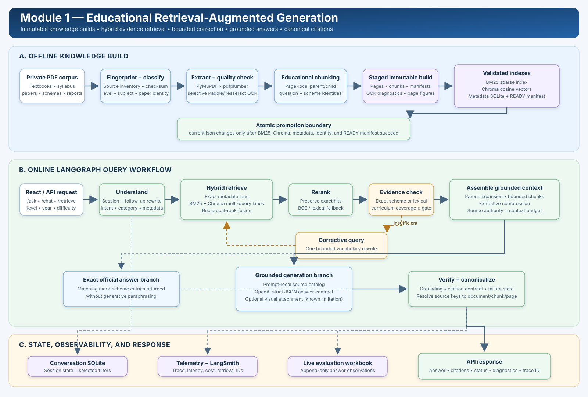
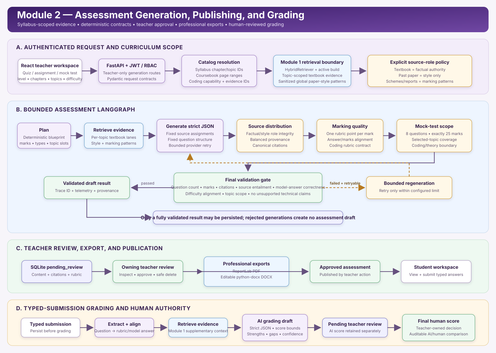

# GenAI-Based EdTech Platform

An end-to-end educational AI platform for Cambridge O Level Computer Science (2210) and A Level Computer Science (9618). The system combines a source-grounded RAG assistant with teacher-controlled assessment generation, professional PDF/DOCX exports, typed-submission grading, and human review.

The repository is organized as a platform root with the deployable application in [`computer-science-rag/`](computer-science-rag/).

## What the platform provides

### Module 1 — Educational RAG

- Reproducible PDF ingestion with PyMuPDF, pdfplumber, selective PaddleOCR, and Tesseract fallback
- Source classification and structured metadata for textbooks, syllabuses, question papers, mark schemes, and examiner reports
- Page-local parent/child chunks and assessment-aware question/mark-scheme parsing
- Hybrid retrieval using exact metadata lookup, BM25, Chroma vector search, reciprocal-rank fusion, and optional BGE reranking
- A bounded LangGraph workflow with query understanding, follow-up rewriting, evidence sufficiency checks, and one corrective retrieval pass
- Deterministic official mark-scheme answers when an exact paper identity is available
- Schema-constrained OpenAI generation, canonical citations, response verification, session memory, tracing, and local telemetry

### Module 2 — Assessment and Grading

- Role-based teacher and student workflows secured with JWT and bcrypt
- Grounded quiz and assignment generation
- Syllabus-scoped 25-mark mock tests with exactly eight questions
- Deterministic source assignment, question structure, topic coverage, rubric, mark-total, and coding-scope validation
- Bounded provider retries and bounded validation retries
- Teacher review and approval before assessments are visible to students
- Professional PDF exports with ReportLab and editable DOCX exports with python-docx
- Typed-submission grading against stored model answers and rubrics
- AI scores retained as drafts until teacher review; human scores remain authoritative
- SQLite persistence for users, assessments, submissions, grades, and audit details

## Architecture

The diagrams below are derived from the executable workflows and storage boundaries in the current codebase.

### Module 1 — Ingestion, retrieval, and grounded answering

[](docs/architecture/module-1-rag.svg)

Module 1 maintains two explicit paths:

1. An offline build path creates an immutable corpus and promotes it only after every index succeeds.
2. An online query path classifies, retrieves, reranks, checks, assembles, generates, verifies, and records each answer.

### Module 2 — Assessment generation, publishing, and grading

[](docs/architecture/module-2-generation.svg)

Module 2 reuses Module 1 retrieval through a defined boundary. It does not duplicate the vector, sparse, metadata, or reranking stacks. Generated assessments are drafts until an owning teacher approves them.

## Architectural guarantees

| Guarantee | Implementation |
|---|---|
| Build consistency | Pages, chunks, manifests, BM25, Chroma, and metadata SQLite belong to one fingerprinted build. `current.json` is replaced only after all indexes succeed. |
| Source authority | Exact mark schemes are authoritative only when paper metadata and question identity match. Textbooks and syllabuses provide curriculum facts; past papers provide assessment style. |
| Bounded execution | Module 1 permits at most one corrective retrieval. Module 2 has configured provider and validation retry limits. |
| Grounded generation | Prompt-local source keys are mapped back to canonical document, chunk, and page identities by application code. |
| Deterministic assessment contracts | Paper structure, topic assignments, mark totals, source distribution, rubric cardinality, and coding scope are application-owned validation gates. |
| Human control | Generated assessments require teacher approval. AI grading produces a reviewable draft; the teacher records the final score. |
| Durable state separation | Rebuildable corpus/index data and durable platform records use separate storage areas. |
| Secret isolation | Credentials are loaded from an ignored local `.env`; generated corpora, databases, source PDFs, caches, and model artifacts are excluded from Git. |

## Technology stack

| Layer | Technologies |
|---|---|
| Frontend | React 18, Vite |
| API and security | FastAPI, Pydantic, JWT, bcrypt |
| Workflow orchestration | LangGraph |
| Retrieval | ChromaDB, BM25, reciprocal-rank fusion, BGE cross-encoder reranking |
| Embeddings and generation | OpenAI API, configurable models |
| Document processing | PyMuPDF, pdfplumber, PaddleOCR, Tesseract, Pillow |
| Exports | ReportLab, python-docx |
| Persistence | SQLite |
| Evaluation and observability | pytest, deterministic evaluation suites, optional RAGAS, LangSmith, local telemetry |

## Repository layout

```text
GenAI-Based-Edtech-Platform/
|-- README.md
|-- .gitignore
|-- docs/
|   `-- architecture/
|       |-- module-1-rag.svg
|       `-- module-2-generation.svg
`-- computer-science-rag/
    |-- backend/
    |   |-- api/                       # FastAPI routes, schemas, JWT/RBAC
    |   |-- module1_rag/
    |   |   |-- ingestion/             # PDF extraction, OCR, cleaning, chunking
    |   |   |-- indexing/              # BM25, Chroma, embeddings, metadata
    |   |   |-- retrieval/             # Classification, fusion, reranking, context
    |   |   |-- chat/                  # LangGraph RAG, generation, memory, verification
    |   |   `-- monitoring/            # Telemetry, tracing, live workbook
    |   |-- module2_generation/
    |   |   |-- quiz/                  # Quiz/assignment boundary
    |   |   |-- mock_test/             # Fixed mock-test contract
    |   |   |-- assessments/           # Catalogs and PDF/DOCX exports
    |   |   |-- grading/               # Grading graph and agreement metrics
    |   |   `-- assessment_engine.py   # Shared assessment LangGraph
    |   `-- shared/                     # Core utilities, prompts, platform store
    |-- frontend/                       # React teacher/student application
    |-- configs/                        # Data, retrieval, and evaluation policy
    |-- evaluation/                     # Deterministic evaluation suites
    |-- ragas_evaluation/               # Optional judge-model evaluation
    |-- scripts/                        # Build, run, reporting, and evaluation commands
    |-- tests/                          # Offline unit, contract, and workflow tests
    |-- Dockerfile
    |-- requirements.txt
    `-- README.md                       # Detailed application operations guide
```

## Prerequisites

- Python 3.12
- Node.js 18 or newer with npm
- An OpenAI API key for production embeddings and generation
- Cambridge source PDFs arranged under `computer-science-rag/Data/`
- Tesseract installed locally if OCR fallback is required

The source PDFs are intentionally not distributed in Git.

## Quick start

### 1. Clone and create the Python environment

```powershell
git clone https://github.com/BasitSol/GenAI-Based-Edtech-Platform.git
cd GenAI-Based-Edtech-Platform
py -3.12 -m venv .venv312
.\.venv312\Scripts\Activate.ps1
python -m pip install --upgrade pip
python -m pip install -r computer-science-rag\requirements.txt
```

On macOS or Linux, activate the environment with:

```bash
source .venv312/bin/activate
```

### 2. Configure the application

```powershell
cd computer-science-rag
Copy-Item .env.example .env
```

At minimum, set:

```dotenv
OPENAI_API_KEY=your-key
JWT_SECRET_KEY=generate-a-long-random-secret
```

Never commit the populated `.env` file.

### 3. Install the frontend

```powershell
cd frontend
npm ci
Copy-Item .env.example .env
cd ..
```

### 4. Build and promote the RAG corpus

Arrange the local data using the folders declared in [`configs/data_sources.yaml`](computer-science-rag/configs/data_sources.yaml), then run:

```powershell
python scripts\build_corpus.py
python scripts\build_indexes.py
```

`build_corpus.py` performs extraction, selective OCR, cleaning, metadata parsing, and educational chunking. `build_indexes.py` creates BM25, metadata SQLite, and Chroma indexes, writes the READY manifest, and atomically promotes the build.

### 5. Start the platform

Terminal 1:

```powershell
python scripts\run_api.py
```

Terminal 2:

```powershell
python scripts\run_frontend.py
```

Open `http://127.0.0.1:5173`. FastAPI documentation is available at `http://127.0.0.1:8000/docs`.

## Main workflows

### Grounded chat

```text
Question -> follow-up rewrite -> classify -> exact/BM25/vector retrieval
         -> RRF -> rerank -> sufficiency check -> context assembly
         -> official scheme or grounded generation -> verification -> response
```

### Teacher assessment lifecycle

```text
Select scope -> generate -> deterministic validation -> pending review
             -> teacher export/review -> approval -> student availability
```

### Student grading lifecycle

```text
Typed submission -> answer extraction -> rubric alignment -> RAG evidence
                 -> AI grade draft -> teacher review -> final human score
```

## API surface

| Area | Representative endpoints |
|---|---|
| Health and RAG | `GET /health`, `POST /ask`, `POST /chat`, `POST /retrieve` |
| Authentication | `POST /auth/register`, `POST /auth/login`, `GET /auth/me` |
| Teacher generation | `POST /assessments`, `GET /syllabus/{level}/chapters`, `POST /mock-tests` |
| Review and exports | `GET /assessments/mine`, `POST /assessment/{id}/approve`, `GET /assessment/{id}/export/{format}` |
| Student workflow | `GET /assessments/available`, `POST /assessment/{id}/submissions`, `GET /student/grades` |
| Grade review | `GET /grades/pending-review`, `POST /grade/{id}/review` |
| Operations | `GET /monitoring/summary`, `GET /evaluation/status`, `GET /observability/summary` |

Role-protected routes require a bearer token issued by `/auth/login`.

## Validation

Run the offline regression suite from `computer-science-rag/`:

```powershell
python -m pytest -q
npm --prefix frontend run build
```

Additional evaluation commands:

```powershell
python scripts\run_evaluation.py
python scripts\run_assessment_evaluation.py
python scripts\run_grading_evaluation.py
python scripts\validate_mock_test_catalog.py
```

Optional RAGAS evaluation may invoke paid judge models and is kept separate from deterministic regression checks.

## Data and storage policy

These paths are local runtime inputs or generated artifacts and are excluded from Git:

- `.venv312/`
- `computer-science-rag/.env`
- `computer-science-rag/Data/`
- `computer-science-rag/data_processed/`
- `computer-science-rag/frontend/node_modules/`
- model caches, SQLite files, evaluation results, logs, and temporary files

The repository contains source code and reproducible build instructions, not private documents or generated vector databases.

## Current limitations

- Source quality and coverage are bounded by the supplied PDFs.
- Diagram pages are extracted during ingestion, but visual-question delivery is not yet end-to-end reliable and Module 2 does not currently embed source images in generated assessments or exports.
- Typed submissions are supported; handwriting recognition is not implemented.
- SQLite targets a single-node deployment. A multi-instance production deployment should migrate durable state to PostgreSQL or an equivalent managed database.
- The local cross-encoder reranker can add noticeable CPU latency on lower-powered machines.
- Generated assessments and AI grades require human review; they must not be represented as official Cambridge materials or final autonomous grading decisions.

## Application guide

For configuration details, build semantics, evaluation policy, and operational commands, see the [application README](computer-science-rag/README.md).
