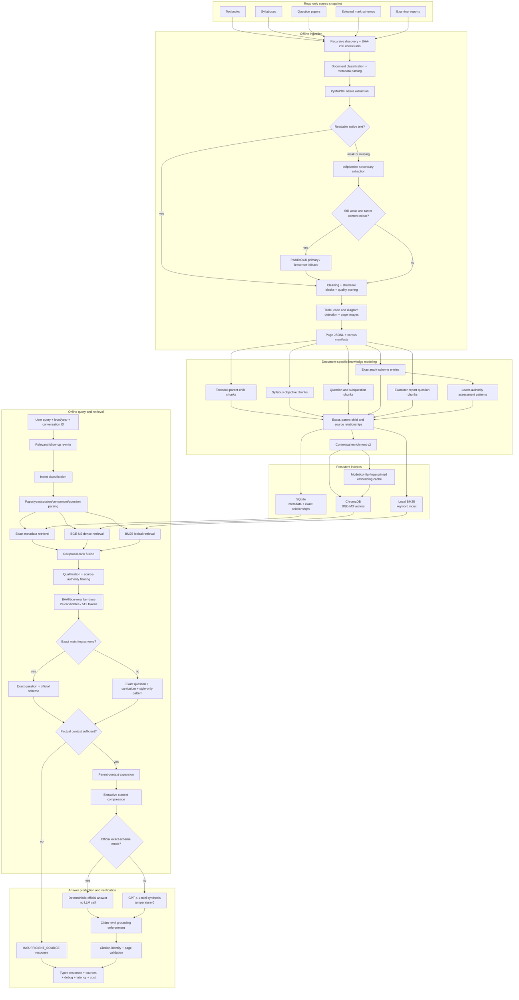

# GenAI-Based EdTech Platform — Phase 1 RAG

A deterministic-first Retrieval-Augmented Generation system for Cambridge O Level Computer Science 2210 and A Level Computer Science 9618.

This directory is the self-contained `computer-science-rag` Phase 1 module of the wider [GenAI-Based EdTech Platform](../README.md). Run all Phase 1 installation, build, test, evaluation, and application commands from this directory.

Phase 1 ingests textbooks, syllabuses, past papers, selected mark schemes, and examiner reports; retrieves authoritative curriculum evidence; and produces grounded answers with page-level citations. Exact mark schemes are handled deterministically, while questions without an exact scheme receive a clearly disclosed model answer grounded in curriculum evidence and assessment-pattern examples.

## Current status

- Core Phase 1 RAG implementation: complete.
- Automated regression suite: 36 tests passing.
- Final embedding architecture: local BGE-M3, not OpenAI embeddings.
- Final cross-encoder: local BGE reranker.
- Final full-capacity index rebuild: intended for a machine with at least 2.8 GB of available RAM.
- Final empirical acceptance: requires a fresh validation result with `all_measured_gates_passed: true` after that rebuild.

Historical OpenAI-embedding metrics are not current System A results.

## Core capabilities

- Recursive PDF discovery, checksums, classification, and normalized document IDs.
- Native PDF extraction with selective PaddleOCR and Tesseract fallback.
- Page-level raw text, cleaned text, quality scores, structure flags, and figure paths.
- Source-specific chunking for textbooks, syllabuses, papers, schemes, and examiner reports.
- Hierarchical textbook child retrieval with parent-context expansion.
- Exact paper-reference parsing and exact question/mark-scheme lookup.
- Hybrid metadata, BGE dense, and BM25 retrieval with reciprocal-rank fusion.
- Full-precision BGE cross-encoder reranking.
- Contextual chunk enrichment and extractive context compression.
- Strict source-authority and exact-versus-pattern controls.
- Deterministic official answers when the exact scheme exists.
- GPT-4.1-mini synthesis only when generation is required.
- Claim-level grounding enforcement and page-level citation validation.
- Four answer modes, conservative abstention, and follow-up conversation state.
- FastAPI backend, Streamlit interface, and reproducible evaluation framework.

## Detailed architecture



The workflow is currently deterministic Python orchestration. LangGraph is not required by the core retrieval implementation and is not a runtime dependency.

## Models, storage, and strategies

| Layer | Final selection | Purpose |
|---|---|---|
| Dense embedding | `BAAI/bge-m3` | Local multilingual semantic retrieval |
| Vector dimensions | 1,024 normalized dimensions | Cosine-compatible dense similarity |
| Embedding capacity | 8,192-token ceiling, dynamic padding | Avoid truncating long but valid chunks |
| Vector database | Persistent ChromaDB | Local vector storage and search |
| Lexical retrieval | Local BM25 | Exact terminology, codes, acronyms, binary, SQL, and pseudocode |
| Metadata retrieval | SQLite | Exact paper identity and relationship lookup |
| Fusion | Reciprocal-rank fusion | Combine dense and lexical rankings without score calibration |
| Cross-encoder | `BAAI/bge-reranker-base` | Higher-precision second-stage passage ordering |
| Reranker configuration | 24 candidates, 512 tokens, full precision | Broad candidate comparison without model downgrade |
| Contextual enrichment | Deterministic `metadata-v2` | Add qualification, source role, paper identity, page, and local cues |
| Context expansion | Textbook child → parent | Restore surrounding explanation after precise child retrieval |
| Context compression | Deterministic extractive compression | Remove irrelevant prose while preserving cited source identity |
| Generator | `gpt-4.1-mini`, temperature 0 | Cost-conscious grounded synthesis |
| Exact answers | Deterministic mark-scheme text | Preserve official wording and avoid unnecessary LLM calls |
| Primary OCR | PaddleOCR | Recover text from raster or damaged source pages |
| OCR fallback | Tesseract | Secondary OCR route when locally installed |

OpenAI is used only for generated answers. Index construction and semantic retrieval do not use OpenAI embeddings and do not incur OpenAI embedding charges.

## Source roles and authority

The system separates evidence into three roles:

1. **Curriculum knowledge** — textbooks and syllabuses provide definitions, explanations, comparisons, calculations, programming concepts, and scope.
2. **Exact assessment evidence** — an exact question, matching mark scheme, or identifiable examiner-report section may support an official answer.
3. **Assessment-pattern evidence** — nonmatching schemes provide style, command-word depth, mark-point structure, and expected conciseness only.

An assessment pattern:

- cannot be called the official answer;
- cannot override syllabus or textbook facts;
- cannot override the exact question's marks;
- cannot be used as factual citation evidence;
- is included only with the appropriate model-answer disclosure.

## Ingestion and OCR strategy

1. Discover every PDF recursively from the unchanged `Data/` snapshot.
2. Calculate SHA-256 checksums and build the document manifest.
3. Classify documents using path, filename, first-page text, subject codes, and paper headers.
4. Extract native text with PyMuPDF.
5. Try pdfplumber when native extraction quality is poor.
6. Run selective OCR on raster pages with missing or low-quality text.
7. Prefer PaddleOCR; use Tesseract as a local fallback.
8. Preserve raw and cleaned page text, OCR provenance, confidence, and quality scores.
9. Detect tables, code, diagrams, and important page images.
10. Store all generated artifacts under `data_processed/`; never modify `Data/`.

## Document-specific chunking

| Source | Strategy |
|---|---|
| Textbooks | Hierarchical parents around 1,500 tokens and overlapping children around 450 tokens |
| Syllabuses | Learning-objective and coherent-section chunks |
| Question papers | Question/subquestion chunks with scenario, identity, marks, and page |
| Mark schemes | Question-specific entries linked to full paper identity |
| Nonmatching schemes | Lower-authority `MARKING_PATTERN` records |
| Examiner reports | Question-specific feedback and guidance chunks |
| Code/pseudocode | Preserve operators, indentation cues, types, loop boundaries, and procedures |

## Retrieval strategy

### Exact references

A query such as `9618/22/M/J/24 Question 3(b)` is parsed into subject code, year, session, component, and question number. It is not treated only as free-text semantic search.

### Hybrid semantic and lexical retrieval

- BGE-M3 retrieves semantically related curriculum evidence.
- BM25 preserves exact terms, identifiers, variable names, commands, and numeric notation.
- SQLite supplies exact metadata matches.
- Reciprocal-rank fusion combines the candidate rankings.
- Authority filtering prevents invalid source roles.
- The BGE cross-encoder reranks the final semantic candidate pool.

For a referenced question without an exact scheme, the actual question wording is extracted from the question-paper chunk and used as the semantic query. This prevents the paper identifier from crowding out the real topic during reranking and compression.

## Contextual enrichment

The embedding and reranking view adds deterministic context such as:

- qualification and subject code;
- source and content type;
- document identity;
- year, session, component, and question number;
- PDF page;
- local section cue.

The original source text remains unchanged for generation and citation display. Enrichment version, model, normalization, and maximum input length are included in the embedding-cache and Chroma collection fingerprint.

## Extractive context compression

After reranking and parent expansion, the compressor selects query-relevant passages under the context budget. It does not paraphrase evidence. Code, tables, short labelled blocks, question text, official scheme evidence, and pattern structure receive conservative handling. Citations continue to identify the original document, page, and chunk.

## Answer modes

| Answer type | When used |
|---|---|
| `CURRICULUM_EXPLANATION` | Normal learning, definition, syllabus, comparison, programming, or calculation query |
| `OFFICIAL_MARK_SCHEME_SUPPORTED_ANSWER` | Full paper and question identity matches an available scheme |
| `AI_GENERATED_MODEL_ANSWER` | Exact scheme unavailable but sufficient curriculum evidence exists |
| `INSUFFICIENT_SOURCE` | Available evidence cannot support a reliable answer |

Generated answers use strict supplied-source grounding. Unsupported claims are removed by a deterministic post-generation checker, and factual lines must use exact supplied citation labels.

## Actual project structure

```text
GenAI-Based-Edtech-Platform/
├── README.md                          # Platform overview and phase index
├── .gitignore                         # Repository-wide security and artifact exclusions
└── computer-science-rag/              # Phase 1: Computer Science RAG
    ├── Data/                          # User-supplied, read-only PDFs; not committed
    │   ├── Books/
    │   ├── Past Papers/
    │   ├── Mark Schemes/
    │   └── Syllabus/
    ├── data_processed/                # Generated locally; not committed
    │   ├── pages/                     # Per-document page JSONL
    │   ├── chunks/                    # Structural chunks and patterns
    │   ├── figures/                   # Diagram/page images
    │   ├── manifests/                 # Checksums, corpus, OCR, and index manifests
    │   ├── indexes/
    │   │   ├── chroma/                # Vector collections + embedding cache
    │   │   └── bm25/                  # Lexical index
    │   └── databases/                 # Metadata and conversation SQLite files
    ├── configs/
    │   ├── data_sources.yaml          # Source discovery rules
    │   ├── baseline.yaml              # Deterministic-first configuration
    │   ├── advanced.yaml              # BGE retrieval configuration
    │   └── evaluation.yaml            # Datasets, metrics, and quality gates
    ├── src/
    │   ├── ingestion/                 # Extraction, OCR, metadata, and quality
    │   ├── chunking/                  # Document-specific chunk construction
    │   ├── indexing/                  # BGE-M3, ChromaDB, BM25, and SQLite
    │   ├── retrieval/                 # Hybrid retrieval, authority, reranking, compression
    │   ├── generation/                # Answering, grounding, and citations
    │   ├── memory/                    # Conversation state and follow-up rewriting
    │   ├── workflows/                 # Deterministic RAG orchestration
    │   ├── api/                       # FastAPI routes and schemas
    │   └── core.py                    # Paths and runtime configuration
    ├── evaluation/
    │   ├── datasets/                  # Public development and validation records
    │   ├── ingestion_eval.py
    │   ├── retrieval_eval.py
    │   ├── answer_eval.py
    │   ├── citation_eval.py
    │   ├── performance_eval.py
    │   ├── quality_gates.py
    │   └── benchmark.py
    ├── scripts/                       # Build, audit, review, evaluation, and run commands
    ├── streamlit_app/                 # Interactive application
    ├── tests/                         # Unit, integration, regression, and quality tests
    ├── .env.example                   # Safe configuration template
    ├── Dockerfile
    ├── pytest.ini
    ├── requirements.txt
    └── README.md                      # This Phase 1 technical guide
```

The 50-record hidden-test split, raw PDFs, generated indexes, answer caches, evaluation outputs, and manual-review exports are deliberately not published in this public repository.

## Installation

### Requirements

- Windows, Linux, or macOS.
- Python 3.12 recommended for PaddlePaddle/PaddleOCR compatibility.
- At least 2.8 GB of available RAM before loading full-precision BGE-M3 on CPU.
- Internet access for the first Hugging Face model download.
- An OpenAI key only for generated answers and full answer evaluation.

### Create the environment

```powershell
git clone https://github.com/BasitSol/GenAI-Based-Edtech-Platform.git
cd GenAI-Based-Edtech-Platform
cd computer-science-rag

py -3.12 -m venv .venv312
.\.venv312\Scripts\Activate.ps1
python -m pip install --upgrade pip
python -m pip install -r requirements.txt
```

On Linux or macOS, activate with:

```bash
source .venv312/bin/activate
```

### Add the source snapshot

Place the shared 25 PDFs under `Data/` using the original structure:

```text
Data/
├── Books/
├── Past Papers/
├── Mark Schemes/
└── Syllabus/
```

The PDFs are excluded from Git because one source exceeds GitHub's regular file-size limit and source redistribution rights may apply.

### Configure generation

```powershell
Copy-Item .env.example .env
```

Set only your local key:

```dotenv
OPENAI_API_KEY=your_key_here
```

Never commit `.env`.

## Final production configuration

```dotenv
GENERATOR_MODEL=gpt-4.1-mini
EMBEDDING_PROVIDER=sentence_transformers
EMBEDDING_MODEL=BAAI/bge-m3
EMBEDDING_DEVICE=cpu
EMBEDDING_MAX_LENGTH=8192
EMBEDDING_BATCH_SIZE=4
CONTEXTUAL_ENRICHMENT_ENABLED=true
RERANKER_ENABLED=true
RERANKER_MODEL=BAAI/bge-reranker-base
RERANKER_DEVICE=cpu
RERANKER_MAX_LENGTH=512
RERANKER_BATCH_SIZE=4
RERANKER_CANDIDATES=24
RERANKER_CONDITIONAL=false
LOCAL_MODEL_MEMORY_MODE=sequential
EXTRACTIVE_COMPRESSION_ENABLED=true
```

Sequential memory mode releases BGE-M3 before loading the full-precision cross-encoder on lower-memory CPU systems. It does not change model precision or dimensions.

## Build the RAG system

Run the complete first-time pipeline:

```powershell
python scripts\build_corpus.py
python -m src.chunking.pipeline
python scripts\build_indexes.py
```

Expected manifest properties after the final index build:

```text
embedding_provider: sentence_transformers
embedding_model: BAAI/bge-m3
embedding_max_length: 8192
contextual_enrichment_version: metadata-v2
reranker_model: BAAI/bge-reranker-base
reranker_max_length: 512
reranker_candidates: 24
extractive_compression: true
```

The embedding cache is keyed by model, normalization, maximum input length, enrichment version, and enriched text. Rebuilding with unchanged configuration reuses cached vectors. A model or enrichment change creates a different collection fingerprint and requires new vectors.

## Run the applications

### Streamlit

```powershell
python scripts\run_streamlit.py
```

### FastAPI

```powershell
python scripts\run_api.py
```

FastAPI documentation is available at `http://localhost:8000/docs` when the API is running.

## API surface

| Method | Endpoint | Purpose |
|---|---|---|
| `GET` | `/health` | Service health |
| `POST` | `/ask` | End-to-end retrieval and answer generation |
| `POST` | `/retrieve` | Retrieval debug endpoint |
| `GET` | `/documents` | Corpus manifest records |
| `GET` | `/evaluation/status` | Evaluation status endpoint |

The `/ask` response contains the answer, answer type, exact-scheme status, disclosure, mark estimate, confidence, citations, retrieved chunks, latency, token usage, estimated cost, generation provider, technical-failure state, and retrieval debug information.

## Testing and evaluation

Run the regression suite:

```powershell
python -m pytest -q
```

Run final validation:

```powershell
python scripts\run_evaluation.py `
  --dataset evaluation\datasets\validation.jsonl
```

The evaluation pipeline separates:

- ingestion coverage and OCR/diagram quality;
- retrieval-only performance;
- answer and status accuracy;
- grounding and citations;
- abstention behavior;
- latency, token usage, technical failures, and generation cost.

### Retrieval and answer metrics

- Recall@5 and Recall@10.
- Mean Reciprocal Rank.
- nDCG@10.
- Source-routing accuracy.
- Exact-scheme retrieval accuracy.
- Required key-point coverage.
- Faithfulness.
- Citation identity accuracy, precision, and coverage.
- Official-status and abstention accuracy.
- Technical failure rate.
- Median and P95 end-to-end latency.
- Input/output tokens and measured generation cost.

### Acceptance gates

| Metric | Required value |
|---|---:|
| Page extraction coverage | ≥99% |
| Recall@5 | ≥90% |
| Recall@10 | ≥95% |
| MRR | ≥0.75 |
| Source-routing accuracy | ≥95% |
| Exact-scheme retrieval accuracy | ≥98% |
| Faithfulness | ≥92% |
| Citation precision | ≥95% |
| Citation coverage | ≥90% |
| Official-status accuracy | 100% |
| Technical failure rate | ≤1% |
| Median latency | ≤5 seconds |
| P95 latency | ≤10 seconds |

The final configuration is empirically accepted only when the fresh validation report states:

```text
all_measured_gates_passed: true
```

Do not use cached answer latency to represent uncached end-to-end performance.

## Evaluation data policy

The complete internal benchmark contains 220 approved records split into 120 development, 50 validation, and 50 hidden-test records. This public repository includes development and validation only. Hidden-test records remain separate to reduce evaluation leakage.

Answer and embedding caches are configuration-fingerprinted. They improve repeat-run cost but are excluded from Git and must not be substituted for a fresh acceptance run.

## Security and repository hygiene

The repository intentionally excludes:

- `.env` and API credentials;
- source PDFs;
- virtual environments;
- Hugging Face model weights;
- extracted pages, chunks, figures, indexes, and databases;
- answer caches and raw evaluation results;
- hidden and candidate benchmark records;
- manual-review exports and local tooling state.

Only `.env.example` should be used as the configuration template. If a secret is ever accidentally committed, revoke it immediately and remove it from Git history before continuing.

## Known limitations

- Accuracy is bounded by the supplied 25-document snapshot and limited exact mark-scheme coverage.
- New mark schemes become retrieval evidence and pattern examples; they do not train model weights.
- Full-precision BGE models are computationally expensive on CPU.
- Tesseract fallback requires a working local executable; PaddleOCR is the primary engine.
- Diagram handling depends on retained page images and question wording.
- The current workflow is deterministic Python orchestration rather than an installed LangGraph graph.
- Final BGE acceptance metrics must be produced after the full-capacity index rebuild.

## License and source material

No license is granted for third-party textbooks, examination papers, mark schemes, syllabuses, or examiner reports. Obtain and use source documents according to their respective copyright and distribution terms.
