# Computer Science Educational RAG — Phase 1

Production-oriented retrieval-augmented generation for Cambridge O Level Computer Science (2210) and A Level Computer Science (9618). This is the `computer-science-rag` module inside the wider GenAI-Based EdTech Platform.

The implementation is a clean v2 architecture. Generated corpora, manifests, embeddings, Chroma data, BM25 indexes, SQLite databases, cached answers, and old evaluation outputs are not part of the source tree. A build becomes active only after corpus creation and every index complete successfully.

## Status

- Fresh v2 source architecture: implemented.
- Offline contract/unit suite: 22 tests passing.
- External services were not invoked during implementation.
- The benchmark generator produces 100 auditable records from exact paper/mark-scheme pairs, curated textbook questions, and clearly labelled source-derived textbook questions when exact pairs are insufficient. Human review remains recommended for source-derived rows.
- OpenAI `text-embedding-3-small` is the active low-memory embedding model.
- `BAAI/bge-reranker-base` is the local second-stage cross-encoder.
- `gpt-4.1-mini` is the default generator and RAGAS judge, configurable in `.env`.

## Architecture

```mermaid
flowchart TD
    subgraph OFFLINE[Versioned offline build]
        PDF[Source PDFs] --> DISC[Discovery + SHA-256 inventory]
        DISC --> PARSE[PyMuPDF extraction]
        PARSE --> QUALITY{Text quality sufficient?}
        QUALITY -- no --> SECOND[pdfplumber recovery]
        SECOND --> OCR{OCR required?}
        OCR -- yes --> PADDLE[PaddleOCR]
        PADDLE --> TESS[Tesseract fallback if needed]
        QUALITY -- yes --> PAGES[Page records]
        OCR -- no --> PAGES
        TESS --> PAGES
        SECOND --> PAGES
        PAGES --> CHUNK[Source-aware page-local chunking]
        CHUNK --> CONTEXT[Deterministic contextual enrichment]
        CONTEXT --> DENSE[OpenAI embeddings + Chroma cosine index]
        CONTEXT --> BM25[BM25 sparse index]
        CHUNK --> META[SQLite metadata + exact-paper relationships]
        DENSE --> PROMOTE[Atomic READY manifest promotion]
        BM25 --> PROMOTE
        META --> PROMOTE
    end

    subgraph ONLINE[Bounded LangGraph workflow]
        USER[User + session] --> MEMORY[Relevant bounded memory]
        MEMORY --> UNDERSTAND[Intent/category/difficulty/reference understanding]
        UNDERSTAND --> POLICY[Adaptive retrieval policy]
        POLICY --> EXACT[Exact metadata retrieval]
        POLICY --> SEM[Dense semantic retrieval]
        POLICY --> LEX[BM25 lexical retrieval]
        EXACT --> RRF[Reciprocal-rank fusion]
        SEM --> RRF
        LEX --> RRF
        RRF --> RERANK[BGE cross-encoder reranking]
        RERANK --> SUFFICIENT{Context sufficient?}
        SUFFICIENT -- no, first time --> REWRITE[Correct query once]
        REWRITE --> POLICY
        SUFFICIENT -- no, after retry --> ABSTAIN[Grounded abstention]
        SUFFICIENT -- yes --> PARENT[Parent expansion]
        PARENT --> COMPRESS[Extractive context compression]
        COMPRESS --> SCHEME{Exact mark scheme?}
        SCHEME -- yes --> OFFICIAL[Deterministic official answer]
        SCHEME -- no --> GENERATE[Schema-constrained generation]
        OFFICIAL --> VALIDATE[Citation identity + response contract validation]
        GENERATE --> VALIDATE
        VALIDATE --> RESULT[Clean answer + separate Sources panel]
        RESULT --> TRACE[Local telemetry + optional LangSmith]
    end
```



### Why this design

| Decision | Rationale | Cost/latency consequence |
|---|---|---|
| Metadata + dense + BM25 | Paper identities, exact technical terms, and paraphrased concepts require complementary retrieval paths. | One query embedding plus local sparse/metadata search. |
| Reciprocal-rank fusion | Combines rankings without pretending BM25 and vector scores are calibrated. | Negligible local cost. |
| BGE cross-encoder | Joint query/passage scoring improves top-context precision after broad retrieval. | Local CPU/RAM latency; applied only to a bounded candidate set. |
| Contextual enrichment | Embeddings see qualification, source role, paper identity, and page as well as source text. | More embedding tokens during the one-time build. |
| Page-local parent/child chunks | Prevents the old page-drift citation bug while balancing precise retrieval and explanatory context. | More records, but bounded expansion. |
| Extractive compression | Removes irrelevant text without introducing facts through abstractive rewriting. | Small local CPU cost; fewer generation tokens. |
| One corrective retry | Recovers vocabulary mismatch without an uncontrolled agent loop. | At most one additional retrieval pass. |
| Deterministic exact-scheme answers | Official evidence should not be paraphrased unnecessarily. | Avoids a generation call. |
| Structured answer/citation contract | The model writes clean Markdown and returns source keys separately; canonical identities are resolved in code. | Prevents source labels from breaking SQL, code, and prose. |
| Immutable build promotion | Runtime cannot mix pages, chunks, embeddings, or models from different builds. | Model/config changes require a new build. |

Hybrid RRF, contextual retrieval, reranking, graph orchestration, and semantic evaluation follow current primary guidance from [Microsoft hybrid ranking](https://learn.microsoft.com/en-us/azure/search/hybrid-search-ranking), [Anthropic contextual retrieval](https://www.anthropic.com/engineering/contextual-retrieval), [Google retrieval and ranking](https://cloud.google.com/vertex-ai/generative-ai/docs/retrieval-and-ranking), [Cohere reranking](https://docs.cohere.com/docs/reranking-best-practices), [LangGraph](https://langchain-ai.github.io/langgraph/how-tos/state-reducers/), [RAGAS metrics](https://docs.ragas.io/en/latest/concepts/metrics/available_metrics/), and [LangSmith evaluation](https://docs.langchain.com/langsmith/evaluation-types).

HyDE, unrestricted agentic retrieval, web fallback, and GraphRAG are not defaults: this corpus has strong document relationships and strict curriculum authority, while those approaches add calls, latency, and failure modes that must first demonstrate benchmark gains.

## Data and source authority

The system discovers textbooks, syllabuses, question papers, mark schemes, and examiner reports below `Data/`. It never modifies the source PDFs.

Authority is explicit:

1. A mark scheme is official only when subject, year, session, component, and question label match.
2. Syllabus and textbooks support curriculum facts and explanations.
3. Examiner reports support examiner feedback.
4. A nonmatching question or scheme cannot be presented as the official answer.

The benchmark combines deterministic exact question/mark-scheme pairs with curated and source-derived textbook curriculum records covering compiler/interpreter, SQL, binary search, memory, networks, databases, and algorithms. Every generated row stores its source page/chunk and provenance; no unsupported gold row is silently invented.

## Actual project structure

```text
computer-science-rag/
├── Data/                         # Local source PDFs; excluded from Git
├── configs/                      # Ingestion, retrieval, and evaluation policy
├── data_processed/               # Generated immutable builds; excluded from Git
│   ├── builds/<build_id>/
│   │   ├── pages/
│   │   ├── chunks/
│   │   ├── indexes/              # Chroma, BM25, metadata SQLite
│   │   └── manifest.json
│   ├── current.json              # Atomically promoted active build
│   └── runtime/                  # Conversation and telemetry SQLite
├── evaluation/
│   ├── datasets/                 # Generated strict benchmark
│   ├── answer_eval.py
│   ├── benchmark.py
│   ├── citation_eval.py
│   ├── excel_report.py
│   ├── failure_analysis.py
│   ├── ingestion_eval.py
│   ├── quality_gates.py
│   ├── ragas_eval.py
│   └── retrieval_eval.py
├── scripts/                      # Explicit user entry points
├── src/
│   ├── api/
│   ├── chunking/
│   ├── generation/
│   ├── indexing/
│   ├── ingestion/
│   ├── memory/
│   ├── observability/
│   ├── retrieval/
│   └── workflows/                # Bounded LangGraph state machine
├── streamlit_app/
├── tests/                        # Offline tests/fakes; no paid calls
├── .env.example
├── requirements.txt
└── README.md
```

## Configuration

Python 3.12 is recommended. From this directory:

```powershell
py -3.12 -m venv .venv312
.\.venv312\Scripts\Activate.ps1
python -m pip install --upgrade pip
python -m pip install -r requirements.txt
Copy-Item .env.example .env
```

Add credentials only to the local `.env`. It is excluded from Git. Library imports never load `.env`; only explicitly invoked scripts do.

Important defaults:

```dotenv
OPENAI_API_KEY=
GENERATOR_MODEL=gpt-4.1-mini
EMBEDDING_MODEL=text-embedding-3-small
RERANKER_MODEL=BAAI/bge-reranker-base
RERANKER_ENABLED=true
EXTRACTIVE_COMPRESSION_ENABLED=true
LANGSMITH_TRACING=false
LANGSMITH_API_KEY=
```

`text-embedding-3-small` is API-hosted and avoids the BGE-M3 embedding model’s local memory requirement. The BGE reranker remains local. Its first use may download model weights from Hugging Face.

## Build commands

This is a clean build; do not run `python -m src.chunking.pipeline` separately. Corpus construction already performs chunking.

```powershell
python scripts\build_corpus.py
python scripts\build_indexes.py
python scripts\generate_enterprise_benchmark.py --target 100
python scripts\export_quality_review.py --sample-size 50
```

The generator uses exact assessment pairs first, then curated textbook questions, and finally source-derived textbook rows to reach the requested count. Source-derived rows are labelled for later human review.

`build_corpus.py` does not require the OpenAI key. `build_indexes.py` embeds the fresh corpus and incurs embedding API usage. It writes `current.json` only after Chroma, BM25, SQLite, and the READY manifest succeed.

## Run the system

```powershell
python scripts\run_streamlit.py
```

or:

```powershell
python scripts\run_api.py
```

FastAPI documentation is available at `http://127.0.0.1:8000/docs`.

Every question submitted in Streamlit is appended to `evaluation/results/live_answers.xlsx`. The live workbook records the question, generated answer, category, difficulty, execution status, retrieved documents/pages, citations, citation validity, latency, token usage, estimated cost, and trace ID. RAGAS is not silently run for arbitrary live questions because context recall and correctness require a gold reference; use the benchmark command below for per-question and aggregate RAGAS scores.

## Verification and evaluation

Offline unit/contract tests do not load `.env` or use paid APIs:

```powershell
$env:OPENAI_API_KEY=$null
$env:LANGSMITH_TRACING="false"
python -m pytest -q
```

Cost-controlled retrieval pilot:

```powershell
python scripts\run_evaluation.py --retrieval-only --limit 10 --allow-partial
```

Full retrieval validation:

```powershell
python scripts\run_evaluation.py --retrieval-only
```

Full answer evaluation and Excel report:

```powershell
python scripts\run_evaluation.py --excel
```

Full semantic evaluation with paid RAGAS judge calls:

```powershell
python scripts\run_evaluation.py --ragas --excel
```

RAGAS is deliberately opt-in. Without `--ragas`, faithfulness, answer relevancy, correctness, context precision/recall, and noise sensitivity are reported as `NOT_MEASURED`; no lexical proxy is substituted. Every benchmark record remains in JSON/Excel with an execution status and error, including retrieval or generation failures.

Measured retrieval metrics are Precision@5/10, Recall@5/10, MRR, nDCG@10, exact-scheme accuracy, coverage, and latency. Deterministic answer metrics are citation identity accuracy, citation gold precision, citation coverage, execution coverage, technical failures, tokens, cost, and latency. RAGAS supplies semantic context precision/recall, faithfulness, relevancy, correctness, and noise sensitivity.

A final run passes only when all required gates are measured and pass. A pilot, partial run, skipped RAGAS stage, missing answer, or failed row cannot produce `all_required_gates_passed: true`.

Metadata, assessment-boundary, and OCR text accuracy are human gates. Complete the three CSV files created under `evaluation/review_packets/` by adding reviewer, review date, and the requested correctness fields. They remain `NOT_MEASURED` until every exported row is reviewed.

## Observability and memory

Local SQLite telemetry records execution status, session, category, latency, tokens, cost, retrieved document/chunk identities, prompt version, model, and failure category. LangSmith tracing is optional and disabled by default. Enabling it can send prompts, source context, and responses to LangSmith, so it should be a deliberate deployment decision.

Conversation memory stores a bounded recent window plus a compact summary. Only linguistically dependent follow-ups are rewritten; a complete question such as “Explain binary search” cannot inherit an earlier SQL topic.

## Reproducibility and security

- `.env`, PDFs, virtual environments, generated builds, Chroma data, databases, caches, evaluation results, and model weights are excluded from Git.
- The manifest records source fingerprints, build identity, embedding model, index identity, counts, and build time.
- Runtime rejects an embedding model that does not match the active index.
- Changing source files, chunking schema, or embedding model requires a new immutable build.
- Never publish a LangSmith or OpenAI key. Revoke any credential that is accidentally committed.

## Known limitations

- Empirical quality is unknown until the fresh user-run build and benchmark finish.
- Quality is bounded by the supplied PDFs and exact mark-scheme coverage.
- OCR and diagram questions require manual spot-checking even when automated quality gates pass.
- RAGAS is judge-model dependent and complements, rather than replaces, gold retrieval metrics and human review.
- CPU cross-encoder reranking can dominate latency on low-memory machines.
